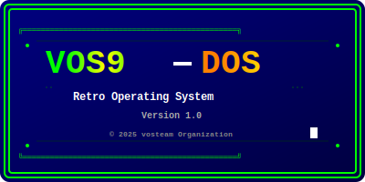

# VOS9-DOS

<p align="center">
  
</p>

   

**VOS9-DOS** - образовательная операционная система с DOS-совместимым интерфейсом, созданная для изучения основ разработки ОС и демонстрации низкоуровневого программирования.

## 🌟 Особенности

- **🎯 Аутентичный DOS-интерфейс** с приглашением `C:\>` и командами в верхнем регистре
- **⌨️ Классическое управление** через командную строку
- **📝 11 основных DOS-команд** с полной функциональностью
- **🚀 Быстрая загрузка** - система готова к работе за секунды
- **💾 Минималистичный дизайн** - образ системы менее 1.5 МБ
- **🔧 Открытая архитектура** для изучения и расширения
- **📚 Полная документация** на русском языке
- **🎓 Образовательная направленность** с подробными комментариями в коде

## 📋 Доступные команды

| Команда | Описание | Статус |
|---------|----------|--------|
| `HELP` | Показать список всех доступных команд | ✅ |
| `CLS` | Очистить экран | ✅ |
| `VER` | Отобразить информацию о версии системы | ✅ |
| `DATE` | Показать текущую дату | ✅ |
| `TIME` | Показать текущее время | ✅ |
| `DIR` | Список файлов и директорий | ✅ |
| `TYPE` | Просмотр содержимого файла | ✅ |
| `COPY` | Копирование файлов | ✅ |
| `DEL` | Удаление файлов | ✅ |
| `MD` | Создание директории | ✅ |
| `EXIT` | Завершение работы системы | ✅ |

## 🚀 Быстрый старт

### Запуск в эмуляторе

```bash
# Скачать релиз или собрать из исходников
make iso

# Запустить в QEMU
qemu-system-i386 -cdrom build/vos9.iso -m 128M
```

### Первые команды

```
C:\>VER
VOS9-DOS Version 1.0

C:\>HELP
For more information on a specific command, type HELP command-name
HELP    CLS     ECHO    TIME    MEM     DIR     
TYPE    COPY    DEL     VER     EXIT    

C:\>ECHO Добро пожаловать в VOS9-DOS!
Добро пожаловать в VOS9-DOS!

C:\>TIME
Current time is 0:02:15 (uptime)
```

## 📚 Документация

- **[📖 Документация](ДОКУМЕНТАЦИЯ.md)** - Обзор архитектуры системы
- **[👤 Руководство пользователя](РУКОВОДСТВО_ПОЛЬЗОВАТЕЛЯ.md)** - Как использовать систему
- **[⚙️ Руководство разработчика](РУКОВОДСТВО_РАЗРАБОТЧИКА.md)** - Разработка и модификация
- **[🔧 Установка](УСТАНОВКА.md)** - Настройка среды разработки
- **[📝 Изменения](ИЗМЕНЕНИЯ.md)** - История версий и планы
- **[❓ FAQ](FAQ.md)** - Часто задаваемые вопросы

## 🛠️ Сборка из исходников

### Системные требования

- Linux (Ubuntu/Debian рекомендуется)
- GCC с поддержкой 32-bit
- NASM
- QEMU
- GRUB tools

### Установка зависимостей

```bash
# Ubuntu/Debian
sudo apt install build-essential nasm qemu-system-x86 grub-pc-bin xorriso gcc-multilib

# Fedora
sudo dnf install gcc nasm qemu-system-x86 grub2-tools xorriso
```

### Сборка

```bash
# Клонирование (если доступно)
git clone https://github.com/vosteam/vos9-dos.git
cd vos9-dos

# Сборка
make clean
make iso

# Запуск
make run-iso
```

## 🏗️ Архитектура

```
VOS9-DOS
├── 🚀 Загрузчик (GRUB2/Multiboot)
├── 🧠 Ядро (kernel.c)
├── 🖥️ Драйверы
│   ├── VGA (текстовый режим)
│   ├── Клавиатура (PS/2)
│   └── Таймер (PIT)
├── 💾 Управление памятью
├── 📁 Файловая система (базовая)
└── 🐚 Командная оболочка
```

## 🎯 Цели проекта

- **📚 Образование**: Изучение разработки операционных систем
- **🔬 Эксперименты**: Площадка для низкоуровневого программирования
- **😊 Ностальгия**: Возвращение к эпохе командной строки
- **🧪 Простота**: Минималистичная и понятная архитектура

## 🤝 Участие в разработке

Мы приветствуем вклад сообщества! Вы можете помочь:

- 🐛 Исправлением ошибок
- ✨ Добавлением новых функций
- 📖 Улучшением документации
- 🧪 Тестированием на различном оборудовании
- 💡 Предложением идей

### Процесс разработки

1. Fork репозитория
2. Создайте ветку для новой функции
3. Внесите изменения
4. Добавьте тесты (если применимо)
5. Обновите документацию
6. Создайте Pull Request

## 📊 Статистика проекта

- **Язык**: C (80%), Assembly (15%), Makefile (5%)
- **Размер кода**: ~2000 строк
- **Размер ISO**: ~4-10 МБ
- **Время сборки**: ~10 секунд
- **Время загрузки**: ~2 секунды

## 🔮 Планы развития

### Версия 1.1
- [ ] Поддержка BAT-файлов
- [ ] Расширенные команды DIR
- [ ] Система переменных окружения

### Версия 1.2
- [ ] Поддержка подкаталогов
- [ ] Команды MD/RD
- [ ] Команда CD

## 📄 Лицензия

```
VOS9-DOS Version 1.0
Copyright (C) 2025 vosteam Organization

Этот проект создан для образовательных целей и изучения
разработки операционных систем.
```

## 🏆 Благодарности

- Сообществу [OSDev](https://wiki.osdev.org/) за документацию
- Создателям инструментов: GCC, NASM, QEMU, GRUB
- Всем, кто вдохновил нас на создание этой системы

## 📞 Контакты

- **GitHub**: [vosteam/vos9-dos](https://github.com/vosteam/vos9-dos) (если доступно)
- **Email**: team@vosteam.org
- **Документация**: Смотрите файлы в этом репозитории

---

<div align="center">

**🎉 Добро пожаловать в мир VOS9-DOS! 🎉**

*Простая, эффективная, ностальгическая операционная система*

[📥 Скачать](../../releases) • [📖 Документация](ДОКУМЕНТАЦИЯ.md) • [❓ FAQ](FAQ.md) • [🤝 Участие](РУКОВОДСТВО_РАЗРАБОТЧИКА.md)

</div>
